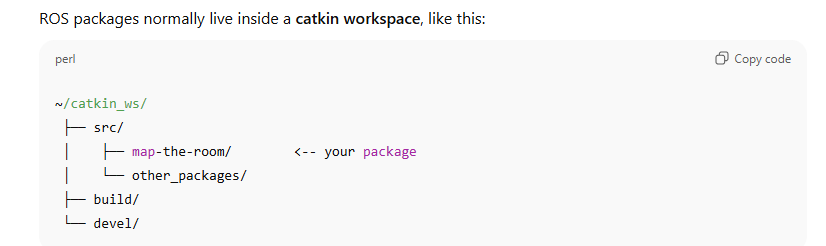
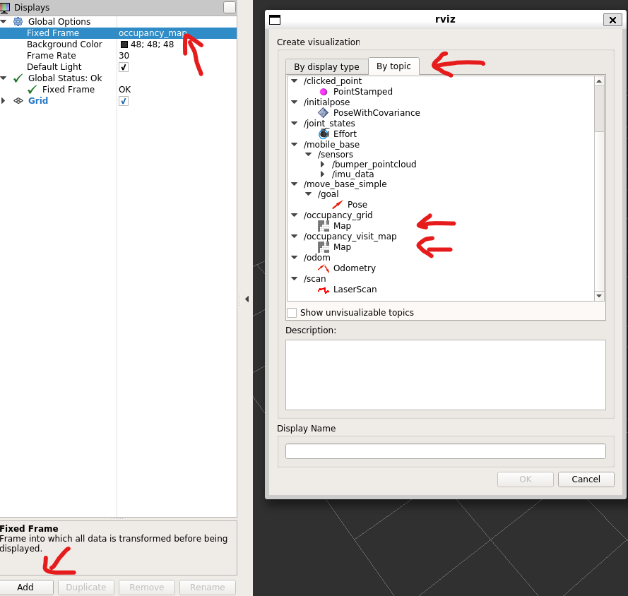

# map-the-room

1. This project proposes the development of an autonomous exploration system for a mobile ground robot (TurtleBot platform) operating in a simulated indoor environment (in Gazebo simulation). The goal is to enable the robot to autonomously navigate an unknown space, avoid obstacles, and incrementally build an accurate 2D occupancy map of the entire room with the frontier exploration methodology without prior knowledge of its layout.

2. The ROS package contains two nodes in parallel: “occupancy grid node” and “path planning node”:
   
   The occupancy grid node is responsible for subscribing to continuous data streams from sensors mounted on the TurtleBot, including the current occupancy grid and visit count grid, odometry data feed, and bumper,     continuously updating its knowledge of the environment. It then publishes these data streams to the path planning through individual ROS topics. 

   The path planning node is responsible for robot locomotion. The global planning module generates a path from the robot’s current position to the nearest of all nearest accessible points in proximity of all current frontiers, where accessibility indicates that if the robot’s center is on a given cell, its rim does not hit any obstacle or unknown cell. The local planning module follows the accessibility rule as the global one, and because global path is generated with partial knowledge of the world, the local planning module commands the robot to follow the global path while reactively avoiding obstacles unmapped at global path planning time. However, during testing, the robot’s radius was inflated by 1.7, as using exactly the radius would cause the robot to get stuck when turning around tight corners.  

4. We are making our work a ROS package suited for easy management. The ROS compatible with ROS1 Kinetic and can be compiled in Ubuntu 16.04. This should be the location of our package in the hierarchy to compile:  

5. This repository only contains the ROS package `map-the-room`, not the catkin_ws, to reproduce the result, you will have to create your own catkin_ws and build the ROS package. The **CMakeLists.txt** is ready to use to build the package. The catkin_ws should be created according to ROS tutorial: https://wiki.ros.org/catkin/Tutorials/create_a_workspace. If you download our repo to other location, move the repo to the location shown in the graph above:   
`mv ~/map-the-room ~/catkin_ws/src/`  
and change your directory to the repo:  
`cd ~/catkin_ws/src/map-the-room`

6. After compilation, run our package `roslaunch map_the_room occupancy_grid.launch` to launch both Gazebo simulation and Rviz visualization. The "map_the_room" is the name of our package, `occupancy_grid.launch` is our custom launch file. The custom launch file includes the world file that we use as the Gazebo simulation environment. Run `roslaunch turtlebot_teleop keyboard_teleop.launch` if you want to activate teleoperate control of the robot. If you do not have custom launch file yet, use the `roslaunch turtlebot_gazebo turtlebot_world.launch` and `roslaunch turtlebot_teleop keyboard_teleop.launch` to initiate default TurtleBot environment. 

7. For Rviz visulization, please set up the software according to the following image:  

8. A new map will be saved everytime running `roslaunch map_the_room occupancy_grid.launch`, overwriting existing map files. The map file contains the map `map.pgm` and metadata `map.yaml`. The default location to save the map is home/{user_name}.

9. To visualize the saved map, first run the ROS core `roscore`. Secondly, open a new terminal and change directory to where the map.pgm and map.yaml is saved, if saved directly from a simulation, it is in home/{user_name}. Then run `rosrun map_server map_server map.yaml`, this will publish the map to the ROS master. Finally, open another new terminal and run `rosrun rviz rviz` to launch Rviz. The frames are already set up correctly, so click "add" in the lower left, click "By topic", and then "Map". The image above can be helpful.     
